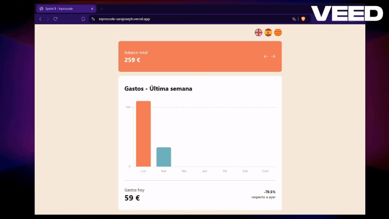

 # Inprocode  
  
App that shows weekly expenses with graphs  
   

  
  
## Getting started  
  
These instructions will give you a copy of the project to run it on your local machine for development and testing purposes.  
  
### Prerequisites  
  
To clone and run this application, you will need Git and Node.js (which comes with npm) installed on your computer.
  
	
### Installation  
  
```bash
# Clone this repository
$ git clone https://github.com/sarajoseph/sprint8-inprocode.git

# Go into the repository
$ cd sprint8-inprocode

# Install dependencies
$ npm install

# Run the app
$ npm run dev
```
  
  
## Dependencies  
  
[](https://vitejs.dev)[](https://react.dev)[](https://typescriptlang.org)[](https://tailwindcss.com)[](https://eslint.org)[](https://standardjs.com)[](https://vitest.dev)    

Vite (https://vitejs.dev)  
ReactJS (https://react.dev)  
Typescript (https://typescriptlang.org)  
Tailwind (https://tailwindcss.com)  
ESLint (https://eslint.org)  
TSStandardJS (https://standardjs.com)  
Vitest (https://vitest.dev)  
  
  
## Notes  
  
### Tailwind compilation  
  
Only the Tailwind classes that are used are loaded. When adding a new one, it must be added to the css file.  
```bash
# Run
npx tailwindcss -i ./src/assets/css/tailwind-input.css -o ./src/assets/css/tailwind-output.css --watch
```
  
  
### ESLint StandardJS test  
  
Find and fix problems with your JavaScript code
```bash
# Run
npx standard

# or
npm test
```
  
  
### Test with Vitest    
  
```bash
# Run
npx vitest
```